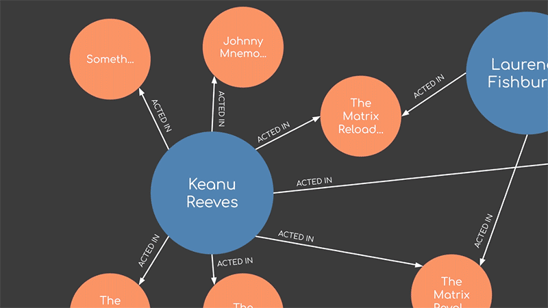
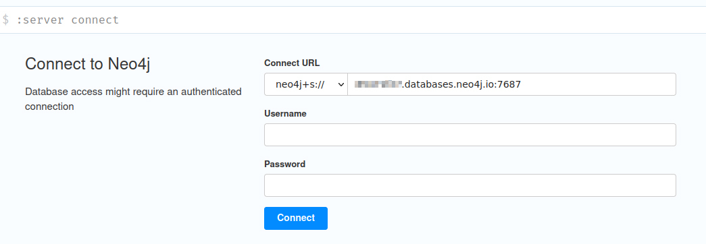

# neo-forte

A simple querying interface for a neo4j database, requiring only knowledge of cypher.



[](https://codecov.io/gh/YizYah/neo-forte)

## Why

Running cypher in js should be *just as simple* as in the data browser!

## What

A few functions that allow anyone who knows cypher to run a query.

It may not be sufficient for everything you'll ever need to do (see [Limitations](#limitations)).  But you can at least get started without studying the [neo4j driver](https://github.com/neo4j/neo4j-javascript-driver#readme).

## Usage

[1] Install the package:

```bash
npm i neo-forte
```

[2] Create a file `.env` at the project root level with these three variables (or add them to an existing one):

* DB_URI
* DB_USER
* DB_PASSWORD

Those are the credentials that you use to log into the data browser:
  

You can just copy over the `.env.sample` file to `.env` and update the values there.

[3] Use the following functions, all defined in API below:

* _**getSession**_ returns a database session.
* _**run**_ runs a query with params in a session.  Returns an array of objects containing your data.
* _**oneRecord**_ a special variation of `run()` that expects a single result and returns an object rather than an array.

You can then use the results directly in your code.  For example:

```typescript
import { getSession, run }  from 'neo-forte'

const queryString =
    `match (movie:Movie)-[:ACTED_IN]-(actor:Person {name: $actor}) return movie.title as title`

const params = {
    actor: 'Tom Hanks'
}

const session = await getSession()

const result = await run(
    session,
    queryString,
    params,
)
// in one sample database, the result is:
// result = [{ title: "Forrest Gump" }, { title: "Big" }]
```

## API

This package fundamentally does two things:

1. Creates a session
2. Runs queries

### Session Creation

As suggested above, the simplest approach is to store these variables in your `.env` file:

* DB_URI,
* DB_USER,
* DB_PASSWORD

But you can also generate them for as many databases as you'd like.

#### DatabaseInfo type

The following type is exposed for your use:

```typescript
interface DatabaseInfo {
  URI: string;
  USER: string;
  PASSWORD: string;
  DATABASE?: string;
}
```

#### getSession()

An async function returning a session:

```typescript
async function getSession(databaseInfo?: DatabaseInfo)
```

Takes an optional [DatabaseInfo](#databaseinfo-type) as its only parameter. If no value is passed for `databaseInfo`:

1. If there are `process.env` variables, then they are used by default.
2. If not, `getSession()` throws an error.

Here's a sample usage relying upon the `.env` file to provide the needed database info:

```typescript
import { getSession } from 'neo-forte'

(async ()=> {
  const session = await getSession()
  console.log(`session=${JSON.stringify(session, null, 2)}`)
})()
```

Here's a usage where `databaseInfo` is set manually:

```typescript
import {DatabaseInfo, getSession} from 'neo-forte'

const databaseInfo:DatabaseInfo = {
  URI: 'neo4j+s://73ab4d76.databases.neo4j.io,
  USER: 'neo4j',
  PASSWORD: '7BxrLxO8Arbce3ffelddl2KJJK2Hyt08vPJ3lPQe60F',
}

(async ()=> {
  const session = await getSession(databaseInfo)
  console.log(`session=${JSON.stringify(session, null, 2)}`)
})()

```

> **_NOTE_**: `getSession()` will also check the validity of your connection.  If the test fails, you will receive an error.

### Running Queries

There are two functions to run a query: `run` and `oneRecord`.

#### run

The main function is:

```typescript
async function run(
    session: Session,
    queryString: string,
    params: any
)
```

`run` returns an array of objects. Simply have your query return specific needed fields or values, and they will appear as keys within the objects of the array.

> **_NOTE_** For best results, do not return simple nodes.  It is not a problem, they will be stored as jsons. But to get to their fields, you'll then need to access their `properties`.

If your query fails to execute, you will receive a clear error message, indicating the specific query and parameters that failed, and what the error was.  For instance:

```terminal
Error: the query set provided does not contain the given query:

query:
-----------------
MATCH (user:User {name:$name})-[:USES]->(resource:Resource {id:$resourceId})
RETURN user.id AS userId, user.name AS userName, resource.id AS resourceId
-----------------   
params: {"name":"Bruce","resourceId":"printer-XYX11aC42s"}
```

#### oneRecord

A second function, just for convenience, is:

```typescript
export async function oneRecord(
    session: Session,
    queryString: string,
    params: any)
```

One record returns an object with the requested fields.  If more than one record is returned, `oneRecord` will return an error message.

If no records are returned, `oneRecord` returns null.

## Limitations

There are many use cases where you'll be best served to call the [neo4j driver](https://github.com/neo4j/neo4j-javascript-driver#readme) directly. `neo-forte` just runs a simple query, but if you want to work with transactions, subscriptions, fancy async processing, or very large numbers, you should use the driver.  It's complex for a reason--it's very versatile.

## Relevant Package and Contributing

This package actually uses [neo-forgery](https://www.npmjs.com/package/neo-forgery), and the two complement each other well. The goal of `neo-forgery` is to allow you to run unit tests by mocking the `neo4j-driver` easily.

Both are part of a mission to make programming with neo4j<a href="#note1" id="note1ref"><sup>2</sup></a> in node or js extremely simple. If you share that vision :thumbsup:, please reach out with issues, or feel free to jump in and contribute!

---

<a id="note1" href="#note1ref"><sup>2</sup></a> Or anything.
